《软件测试》学习笔记（自整理）

A  **crash** is when your competitor’s program dies.

When your program dies, it is an “**idiosyncrasy**”.

## 第一章 软件测试的背景

##### 1.1 软件错误用例

- 迪士尼的狮子王
- 英特尔奔腾浮点除法缺陷
- 美国航天局火星极地登陆者号探测器
- 爱国者导弹防御系统
- 千年虫问题
- 危险的预见

##### 1.2 软件缺陷是什么

- defect、failure、fault指的是确实严重的情况，甚至是危险的情况。

- anomaly、incident、variance主要指未按预料的运行，甚至是危险的情况。

- problem、error、bug比较常用

  **想怎么称呼就怎么称呼，这不是关键点**

**产品说明书（product specification)**：它对开发的产品进行定义，给出产品的细节、如何做、做什么、不能做什么。

**软件缺陷（software bug）**：

​	1.**Doesn’t do something it should do.**  

​	2.**Does something  it shouldn’t do.**  

​	3.**Does something it doesn’t mention.** 

​	4.**Doesn‘t do something it doesn’t mention but should.**  

​	5.**It’s difficult to understand, hard to use, slow, or——in the software tester's eyes——will be viewed by the end user as just plain not right.**  

**PS**：每个使用过一些软件的人都会对软件的工作方式有自己的意见和想法，要编写所有人都满意的软件是不可能的。作为软件测试员，在运用第五条测试规则时，应记住：**要全面，最重要的是要客观评价**，并非所有测试发现的缺陷都要修改。

##### 1.3 为什么会出现软件缺陷

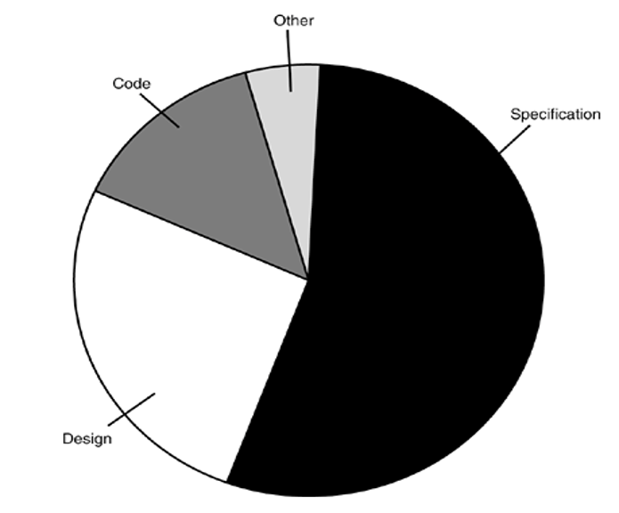

软件缺陷产生的原因有很多，但主要原因是**产品说明书**，很多情况下，spec写的不够全面、经常更改或者小组交流不到位。其次是**设计**，程序员规划软件的过程。

##### 1.4 Software Bug的修复费用

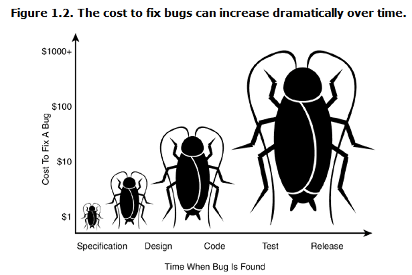

**随着时间的推移，修复bug的费用惊人地增长**

##### 1.5 软件测试员究竟做些什么

​	● The goal of a software tester is to find bugs.

​	● The goal of a software tester is to find bugs and find them as early as possible.

​	● The goal of a software tester is to **find bugs**, find them **as early as possible**, and **make sure they get fixed**

##### 1.6 软件测试员应有的素质

What Makes a Good Software Tester?
	● relentless 
	● creative 
	● good judgment 
	● tactful and diplomatic 
	● persuasive
	●software programming
	●expert in non-computer field

好的测试员坚持不懈地追求完美。**X**

**ANS**：好的测试员知道何时完美无法企及，何时已经“够好”

## 第二章 软件开发的过程

The specifics of **what these people do**, **how they interact**, and **how they make decisions** are all part of the software development process.

- What major components go into a software product

- What different people and skills contribute to a software product

- How software progresses from an idea to a final product

##### 2.1 产品的组成部分

**产品投入：**

1. 明确客户需求

   （利用焦点人群审视软件功能）

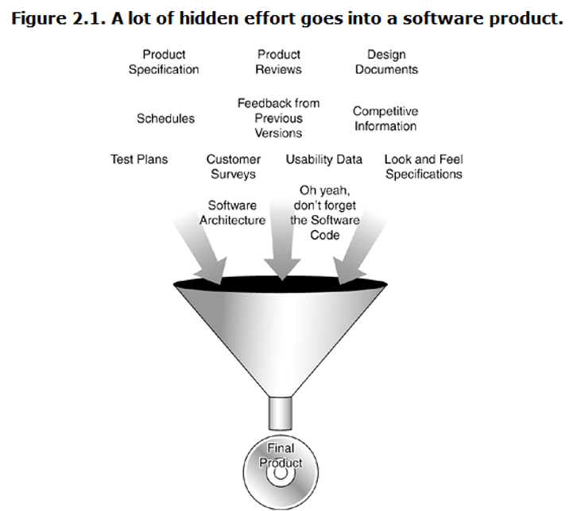

2. Specification

   ■ The result of the customer requirements studies is really just raw data. 
   ■ It doesn't describe the proposed product, it just confirms whether it should (or shouldn't) be created and what features the customers want. 
   ■ The specifications take all this information plus any unstated but mandatory requirements and truly define what the product will be, what it will do, and how it will look.

   ■ The format of specifications varies greatly. 

3. Scheduling

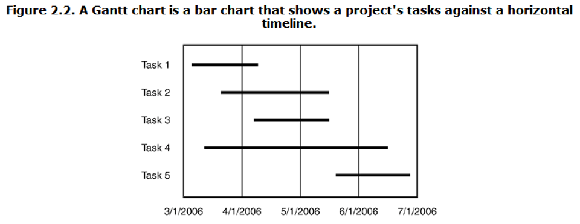

**指定进度表的目的是了解哪项工作完成了，还有多少工作要做，何时全部完成**

4. Software Design Documents
   - **结构文档**。描述软件整体设计的文档，包括软件所有主要部分的描述以及相互之间的交互方式
   - **数据流图**。表示数据在程序中如何流动的正规示意图
   - **状态转换图**。表示不同状态间的转换的方式
   - **流程图**。用图形描述程序逻辑的传统方式
   - **代码注释**

5. Test Documents
   - 测试计划。描述用于验证软件是否符合产品说明书和客户需求的整体方案，包括质量目标、资源需求、进度表、任务分配、方法等。
   - 测试用例。列举测试的项目，描述验证软件的详细步骤
   - 缺陷报告。描述执行测试用例找出的问题
   - 测试工具和自动测试
   - 度量、统计和总结。

**软件产品组成部分**

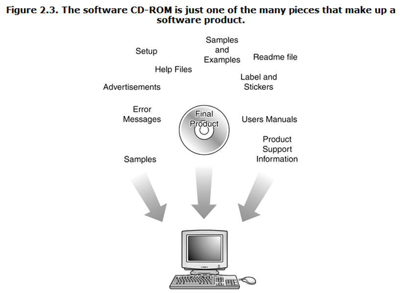

**NOTICE**

- It's also important to realize that when the product is ready to be boxed up and shipped out the door, it's not just the code that gets delivered.
- Numerous supporting parts go along with it. 
- Since all these parts are seen or used by the customer, they need to be tested too.
- DON'T FORGET TO TEST ERROR MESSAGES

##### 2.2 软件项目成员

- *项目经理、程序经理或监制人员* 自始至终驱动整个项目。通常负责编写产品说明书、管理进度、进行重大决策。
- *体系架构师或者系统工程师* 是技术专家
- *程序员、开发人员或者代码制作者* 设计、编写软件并修复软件中的缺陷
- *测试员或质量保证（QA）员* 负责找出并报告软件产品的问题。
- *技术作者、用户协作专员、用户培训专员、手册编写员或者文案专员* 编制软件产品附带的文件和联机文档。
- *配置管理员或构建员* 负责把程序员编写的代码及技术作者写出的全部文档资料组合在一起，合成一个软件包。

##### 2.3 软件开发生命周期模式

**1. 大爆炸模式**

优点：简单。计划、进度安排和正规开发过程几乎没有，所有精力都花在开发软件和编写代码上。

缺点：软件已经完成，软件测试的工作其实就是报告发现的问题让客户知道。另外，产品已经完工，准备交付，测试工作越深入就会发现越来越多的软件缺陷，争吵就越多。

**尽量避开在此模式下进行测试。**

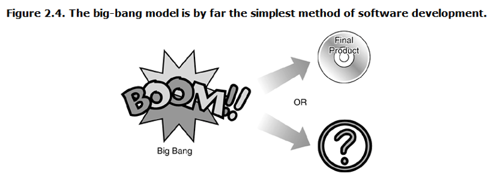

**2.边写边改模式**

“没有时间做好，但总有时间完成”  极其适用快速制作和用完就扔的小项目。

这时软件测试员将陷入无休止的循环往复，几乎每一天都会拿到新的软件版本并着手进行测试。

这种模式是最有可能碰到的，是软件开发的入门，有助于理解更加正规的方法。

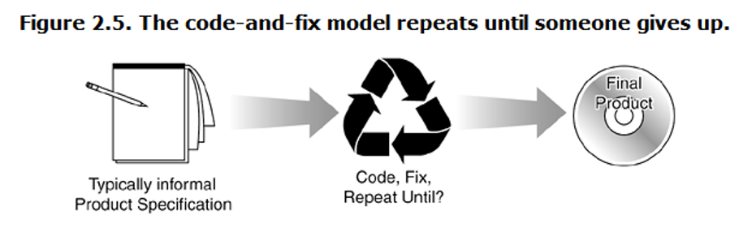

**3.瀑布模式**

- 非常强调产品的定义
- 各步骤分立、没有交叉
- 无法回溯

从测试的角度：这种模式所有一切都有完整细致的说明，所有细节都确定并有文档记录，而且实现在软件中，测试小组能制定精确的计划和进度。但是因为测试仅在最后进行，**一些根本性问题可能出现在早期，但是直至准备发布产品时才可能被发现。**

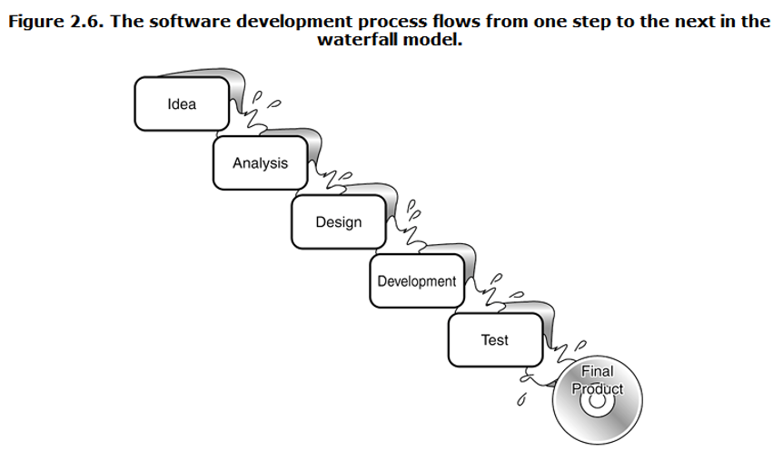

**4.螺旋模式**

每一次循环都包括6个步骤：

- 确定目标、可选方案和限制条件
- 明确并化解风险
- 评估可选方案
- 当前阶段开发和测试
- 计划下一阶段
- 确定进入下一阶段的方法

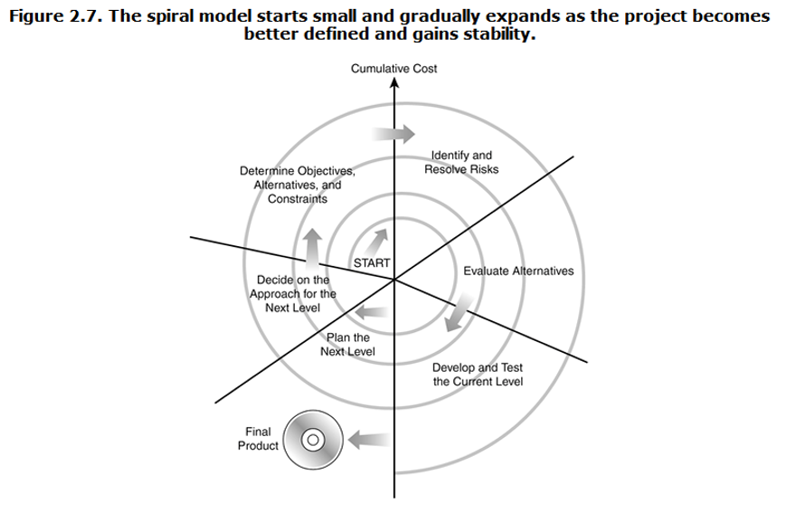

**Agile software development** 敏捷软件开发

**Test-Driven Development（TDD）**

1. Test-driven is a form of development:
   1. Write test code first
   2. Do not write any production code unless tests exist
   3. Does the test determine what code needs to be written
   4. Require maintenance of a comprehensive test set

2. The basic process of test-driven development
   - Define application requirements
   - Familiarize yourself with the functional areas of the application and determine the individual functional items or functional requirements to be used
   - Create a test list of validation requirements
   - Define interfaces and classes for functions or requirements
   - Write test code
   - Run the test
   - Generate production code from the tests
   - Rerun the tests and modify the production code based on the tests until all the tests pass
   - Trim code
   - Repeat the above steps

***V-MODEL***

加强的瀑布模型，在进入下一阶段之前确认上一阶段。这种模式，在一开始软件测试就已经开始了，只要需求分析写好了。

优点：

- 在V模型中，每个阶段都有特定的可交付成果。
- 由于在生命周期的早期开发测试计划，比瀑布模型成功的几率更高。
- 与瀑布模型相比，时间关注点很低，甚至可以说少了50%。
- 适用于容易理解需求的小型项目。
- 资源的利用率很高。

缺点：

- 非常严格，就像瀑布模型。
- 灵活性小，调整范围大，难度大，成本高。
- 软件是在实现阶段开发的，因此不会生成软件的早期原型。
- V模型没有为测试阶段发现的问题提供清晰的路径。

***W-MODEL***

测试伴随着整个软件开发周期不仅要测试程序，还要测试需求、设计和功能根据W模型的要求，一旦提供了文档，就需要确定测试条件并及时编写测试用例

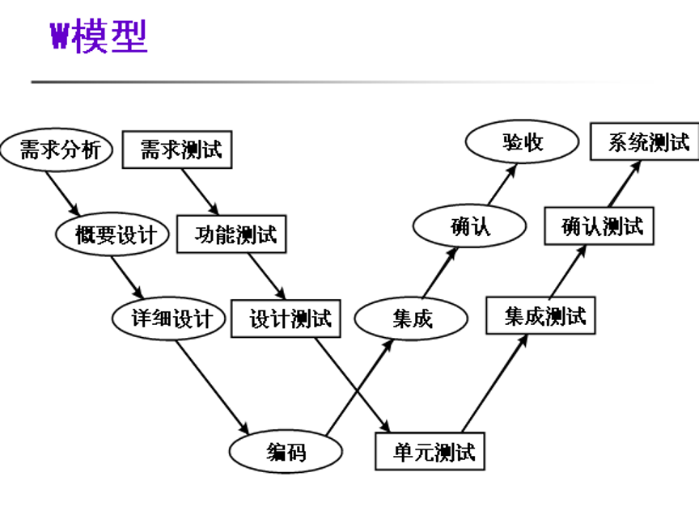

***H-MODEL***

软件测试不仅仅指测试的执行，还包括很多其他的活动。
软件测试是一个独立的流程，贯穿产品整个生命周期，与其他流程并发的进行。
软件测试要尽早准备，尽早执行。
软件测试是根据被测物的不同而分层进行的。不同层次的测试活动可以按照某个次序先后进行的，但也可能是反复的。

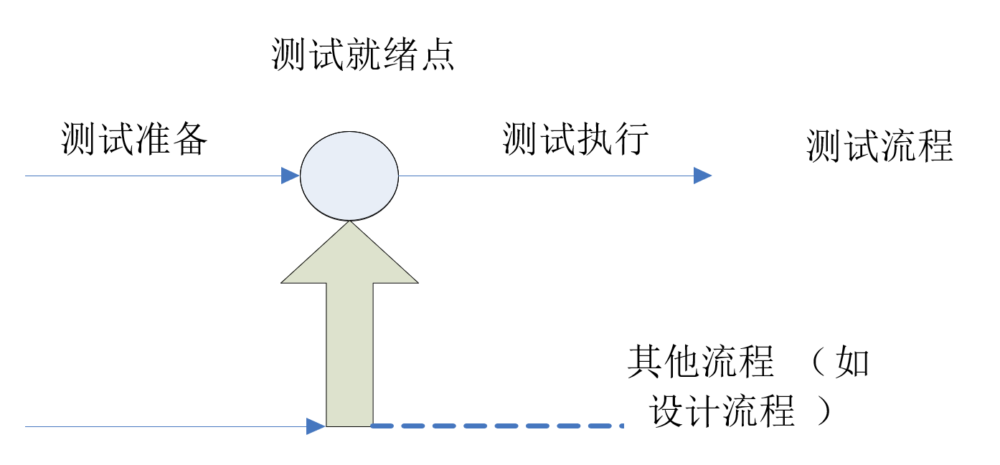

***X-MODEL***

X 测试模型的左边描述的是针对单独程序片段所进行的相互分离的编码和测试，此后将进行频繁的交接，通过集成最终合成为可执行的程序(右上半部分)，这些可执行程序还需要进行测试。
X模型中已通过集成测试的成品可以进行封版并提交给用户，也可以作为更大规模和范围内集成的一部分。
X 模型还定位了探索性测试(右下方)。

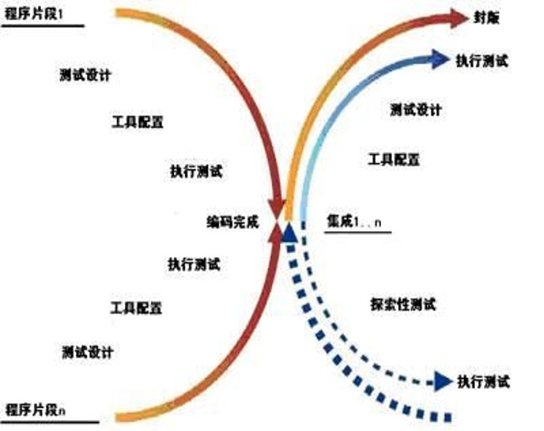

## 第三章 软件测试的实质

##### 软件测试的实际情况

实际情况下，不可能完全符合某个model，也不可能完美地符合用户需求，也不可能有足够的时间做完需要做的所有测试。**但是，对于一个高效的软件测试员，你需要理解理想进程是什么，这样才知道目标是什么样的。**

##### 3.1 软件测试的原则

- 完全测试程序是不可能的

  > 输入量太大
  >
  > 输出结果太多
  >
  > 软件执行路径太多
  >
  > 软件说明书是主观的，可以说从旁观者来看是缺陷的

- 软件测试是有风险的

  > 软件测试员要学会的关键在于，如何把数量巨大的可能测试减少到可以控制的范围，以及如何针对风险做出明智的抉择，哪些测试重要，哪些不重要。
  >
  > **每一个软件项目都有一个最优的测试量**
  >
  > 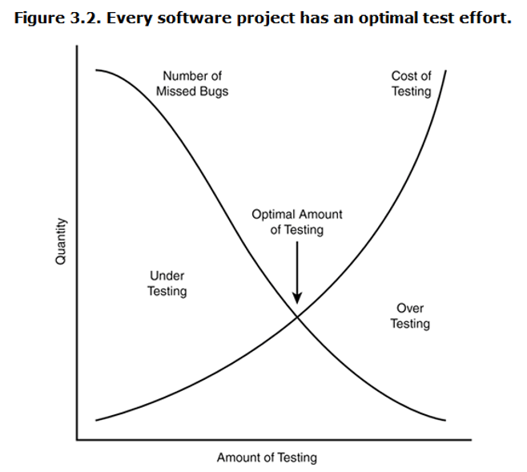

- 测试无法显示潜伏的软件bug

  > 只能保证在你测试的范围内无bug，并不能保证软件是完美的

- 找到的软件bug越多，就说明软件bug越多

  > 原因：程序员也有心情不好的时候，程序员往往犯同样的错误，某些软件bug实乃冰山一角

- 杀虫剂怪事

  > 描述软件测试越多，其对测试的免疫力越强的现象

- 并非所有软件bug都要修复

  > 原因：没有足够的时间，不算真正的软件bug，修复的风险太大，不值得修复

- 什么时候才叫bug难以说清

  > 回顾第一章bug定义规则
  >
  > 尚未发现或未观察到的软件bug只能说是潜在bug

- 产品说明书没有最终版本

- 软件测试在产品小组终不受欢迎

  > 早点找出bug，控制情绪，不要总是报告坏消息

- 软件测试是一项讲究条理的技术专业

##### 3.2 软件测试的术语与定义

- 精确和准确

  以射飞镖为例，精确是指飞镖都在一个位置，准确是指飞镖都很接近靶心

- 确认和验证

  确认是保证软件符合spec的过程，验证是保证软件满足用户要求的过程

- 质量和可靠性

  可靠性是质量的一个方面

- 测试和质量保证

  软件测试员：尽可能早地找出所有软件bug，并确保bug得以修复。

  软件质量保证：创建和执行改进软件开发过程并防止软件缺陷发生的标准和方法

## 第四章 黑盒测试

##### 4.1 黑盒测试

黑盒测试又称功能测试、数据驱动测试或基于规格说明书的测试，是一种从用户观点出发的测试。

**测试人员把被测程序当作一个黑盒子**

主要检测的错误类型：

- 不正确或遗漏的功能
- 接口或界面错误
- 性能错误
- 数据结构或外部数据访问错误
- 初始化或终止条件错误等

黑盒测试对程序的功能性测试要求：

- 每个软件特性必须被一个测试用例或一个被认可的异常所覆盖
- 利用数据类型和数据值的最小集测试
- 利用一系列真实的数据类型和数据值运行，测试超负荷及其他”最坏情况“的结果
- 利用假想的数据类型和数据值运行，测试排斥不规则输入的能力
- 测试影响性能的关键模块，如基本算法、精度、时间、容量等是否正常

**优点**：

1. 有针对性地寻找问题，定位问题更精准
2. 黑盒测试可以证明产品是否达到用户的工作要求
3. 与软件实现无关，就算实现发生变化，测试用例仍然可用
4. 测试用例开发可以与软件开发同时进行，可节省软件开发时间，通过软件的用例就可以设计出大部分黑盒测试用例
5. 能重复执行相同的动作，测试工作中最枯燥的部分可交由机器完成。

实施过程：

1. 测试计划阶段
2. 测试设计阶段：根据程序需求规格说明书或用户手册，按照一定规范化的方法进行软件功能划分和设计测试用例
3. 测试执行阶段：按照设计的测试用例执行测试；自由测试。
4. 测试总结阶段

**测试用例**：描述输入、动作、或者时间和一个期望的结果的文档，其目的是确定应用程序的某个特性是否正常的工作。其基本要素是测试用例编号、测试标题、重要级别、测试输入、操作步骤、预期结果。

##### 4.2 黑盒测试之测试用例设计技术：

- 等价类划分方法
- 边界值分析方法
- 错误推测方法
- 因果图方法
- 判定表方法

**等价类划分方法**：

是把所有可能的输入数据,即程序的输入域划分成若干部分（子集）,然后从每一个子集中选取少数具有代表性的数据作为测试用例.该方法是一种重要的,常用的黑盒测试用例设计方法.

1. 划分等价类

   等价类是指某个输入域的子集合。在该子集合中，各输入数据对于揭露程序中的错误都是等效的。**并合理地假定：测试某等价类的代表值就等于对这一类其他值的测试**所以可以划分等价类之后在每个类中取一个数据作为测试的输入条件，就可以用少量代表性的测试数据，取得较好的测试结果。

   两种不同的情况：

   - 有效等价类

     是指对于程序的规格说明来说是合理的,有意义的输入数据构成的集合。
     利用有效等价类可检验程序是否实现了规格说明中所规定的功能和性能。

   - 无效等价类

     与有效等价类的定义恰巧相反。
     无效等价类指对程序的规格说明是不合理的或无意义的输入数据所构成的集合。
     对于具体的问题，无效等价类至少应有一个，也可能有多个。

   **设计测试用例时，要同时考虑这两种等价类。因为软件不仅要能接收合理的数据，也要能经受意外的考验，这样的测试才能确保软件具有更高的可靠性**

2. 划分等价类的标准

   **完备测试、避免冗余**

   实际上是集合的划分，划分为不相交的一组子集，而子集的并是整个集合

   （并是整个集合：完备性；子集互不相交：保证一种形式的无冗余性）

3. 划分等价类的方法

   **①** 在输入条件规定了取值范围或值的个数的情况下,则可以确立一个有效等价类和两个无效等价类。
   如：输入值是学生成绩，范围是0～100

   有效类：1≤成绩≤100；无效类：成绩<0；成绩>100；

   **②** 在输入条件规定了输入值的集合或者规定了“必须如何”的条件的情况下,可确立一个有效等价类和一个无效等价类。
      如  查询条件=9， 一个等于9，一个不等9

   **③** 在输入条件是一个布尔量的情况下,可确定一个有效等价类和一个无效等价类。

     如 Yes or no

   **④** 在规定了输入数据的一组值（假定n个）,并且程序要对每一个输入值分别处理的情况下,可确立n个有效等价类和一个无效等价类。
   例：输入条件说明学历可为:专科、本科、硕士、博士四种之一，则分别取这四种这四个值作为四个有效等价类，另外把四种学历之外的任何学历作为无效等价类。

   **⑤** 在规定了输入数据必须遵守的规则的情况下,可确立一个有效等价类（符合规则）和若干个无效等价类（从不同角度违反规则）。

   **⑥** 在确知已划分的等价类中各元素在程序处理中的方式不同的情况下,则应再将该等价类进一步的划分为更小的等价类。

4. 设计测试用例

   在确立了等价类后，可建立等价类表，列出所有划分出的等价类输入条件

   然后从划分出的等价类按以下三个原则设计测试用例：

   ①为每一个等价类规定一个唯一的编号。
   ②设计一个新的测试用例,**使其尽可能多地覆盖尚未被覆盖地有效等价类**,重复这一步，直到所有的有效等价类都被覆盖为止。
   ③设计一个新的测试用例,**使其仅覆盖一个尚未被覆盖的无效等价类**,重复这一步，直到所有的无效等价类都被覆盖为止。

**边界值分析法**

这是对等价类划分法的补充

1. 长期的测试工作经验告诉我们,大量的错误是发生在输入或输出范围的边界上,而不是发生在输入输出范围的内部.因此针对各种边界情况设计测试用例,可以查出更多的错误。

2. 与等价划分的区别

   - 边界值分析不是从某等价类中随便挑一个作为代表，而是使这个等价类的每个边界都要作为测试条件。
   - 边界值分析不仅考虑输入条件，还要考虑输出空间产生的测试情况

3. 基于边界值分析方法选择测试用例的原则

   - 如果输入条件规定了值的范围,则应取刚达到这个范围的边界的值,以及刚刚超越这个范围边界的值作为测试输入数据。

     > 例如，如果程序的规格说明中规定：“重量在10公斤至50公斤范围内的邮件，其邮费计算公式为……”。作为测试用例，我们应取10及50，还应取10.01,49.99,9.99及50.01等。

   - 如果输入条件规定了值的个数,则用最大个数,最小个数,比最小个数少一,比最大个数多一的数作为测试数据。

     > 比如，一个输入文件应包括1~255个记录，则测试用例可取1和255，还应取0及256等。

   - 将规则1）和2）应用于输出条件，即设计测试用例使输出值达到边界值及其左右的值。

     > 例如，某程序的规格说明要求计算出“每月保险金扣除额为0至1165.25元”，其测试用例可取0.00及1165.24、还可取一0.01及1165．26等。

   - 如果程序的规格说明给出的输入域或输出域是有序集合,则应选取集合的第一个元素和最后一个元素作为测试用例。

   - 如果程序中使用了一个内部数据结构,则应当选择这个内部数据结构的边界上的值作为测试用例。

   - 分析规格说明,找出其它可能的边界条件。

**错误推测法**

基于经验和直觉推测程序中所有可能存在的各种错误，从而有针对性地设计测试用例地方法

错误推测方法的基本思想: 列举出程序中所有可能有的错误和容易发生错误的特殊情况,根据他们选择测试用例。

> 例如, 输入数据和输出数据为0的情况；输入表格为空格或输入表格只有一行. 这些都是容易发生错误的情况。可选择这些情况下的例子作为测试用例。 

**因果图方法**

考虑输入条件之间的相互组合,可能会产生一些新的情况. 但要检查输入条件的组合不是一件容易的事情, 即使把所有输入条件划分成等价类,他们之间的组合情况也相当多. 因此必须考虑采用一种适合于描述对于多种条件的组合,相应产生多个动作的形式来考虑设计测试用例。这就需要利用因果图（ Cause一Effect Graphics ）方法。
采用因果图方法能够帮助我们按一定步骤，高效率地选择测试用例，同时还能为我们指出，程序规格说明描述中存在着什么问题。 

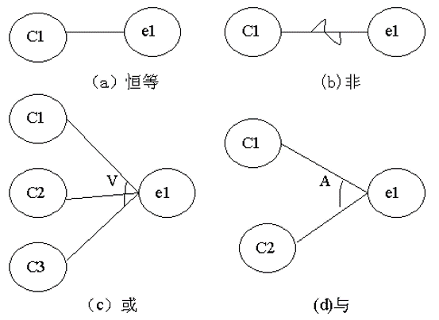

###### 左节点表述输入状态（原因），右节点表示输出状态（结果）

输入状态相互之间还可能存在某些依赖关系，称为约束。在因果图中用特定的符号表示。

> - 输入条件的约束有以下4类：
>
> ① E约束（异）：a和b中至多有一个可能为1，即a和b不能同时为1。
>
> ② I约束（或）：a、b和c中至少有一个必须是1，即 a、b 和c不能同时为0。
>
> ③ O约束（唯一）；a和b必须有一个，且仅有1个为1。
>
> ④R约束（要求）：a是1时，b必须是1，即不可能a是1时b是0。
>
> - 输出条件约束类型
>
> 输出条件的约束只有M约束（强制）：若结果a是1，则结果b强制为0。

因果图最终生成地是判定表。适合于检查程序输入条件的各种组合情况。

> **利用因果图生成测试用例的基本步骤:**
>
> (1) 分析软件规格说明描述中, 那些是原因(即输入条件或输入条件的等价类),那些是结果(即输出条件), 并给每个原因和结果赋予一个标识符。
>
> (2) 分析软件规格说明描述中的语义.找出原因与结果之间, 原因与原因之间对应的关系. 根据这些关系,画出因果图。
>
> (3) 由于语法或环境限制, 有些原因与原因之间,原因与结果之间的组合情况不不可能出现. 为表明这些特殊情况, 在因果图上用一些记号表明约束或限制条件。
>
> (4) 把因果图转换为判定表。
>
> (5) 把判定表的每一列拿出来作为依据,设计测试用例。

因果图方法是一个非常有效的黑盒测试方法，它能够生成没有重复性的且发现错误能力强的测试用例，而且对输入、输出同时进行了分析。

**判定表驱动测试方法**

判定表通常由4个部分组成：

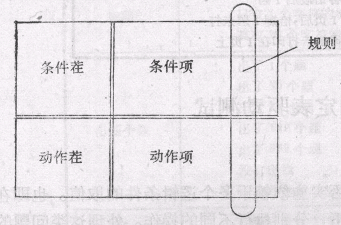

- 条件桩（Condition Stub）:列出了问题的所有条件，通常认为列出得条件的次序无关紧要。
- 动作桩（Action Stub）:列出了问题规定可能采取的操作，这些操作的排列顺序没有约束。
- 条件项（Condition Entry）:列出针对它左列条件的取值，在所有可能情况下的真假值。
- 动作项（Action Entry）:列出在条件项的各种取值情况下应该采取的动作。
- 规则:任何一个条件组合的特定取值及其相应要执行的操作称为规则。在判定表中贯穿条件项和动作项的一列就是一条规则。显然,判定表中列出多少组条件取值,也就有多少条规则,既条件项和动作项有多少列。

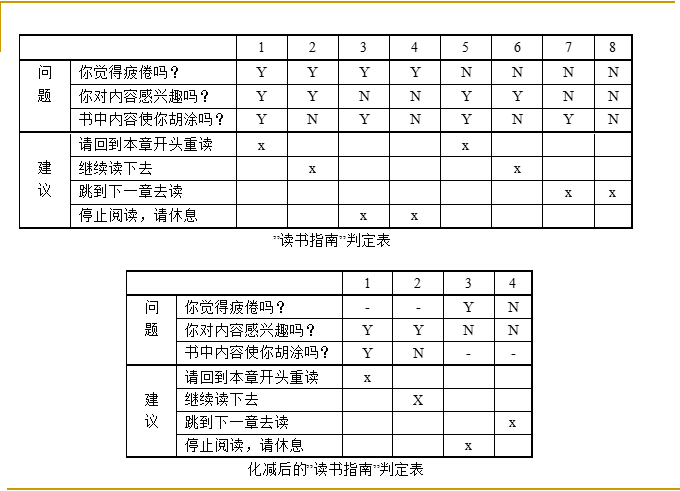

> 判定表的建立步骤：
>
> ①确定规则的个数.假如有n个条件。每个条件有两个取值（0,1）,故有2n种规则。
>
> ②列出所有的条件桩和动作桩。
>
> ③填入条件项。
>
> ④填入动作项。等到初始判定表。
>
> ⑤简化.合并相似规则（相同动作）。

## 第五章 白盒测试